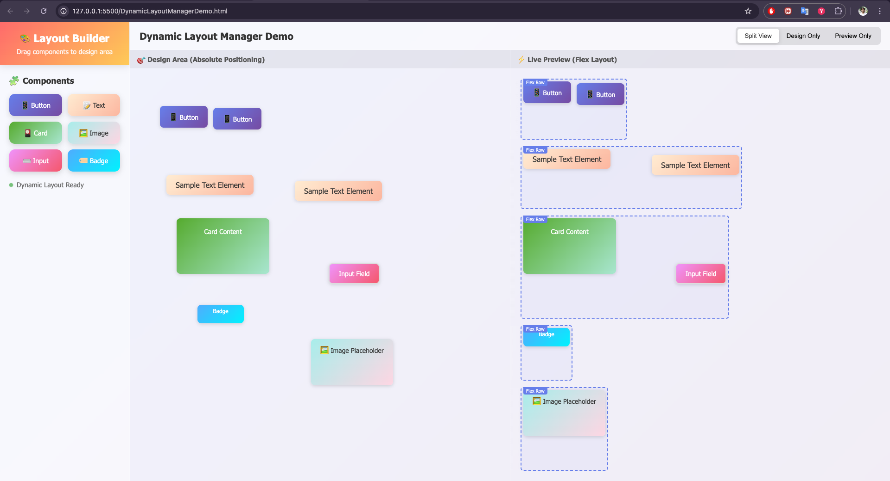
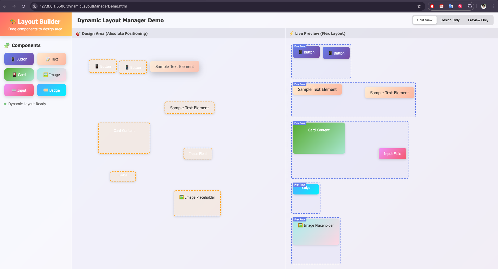
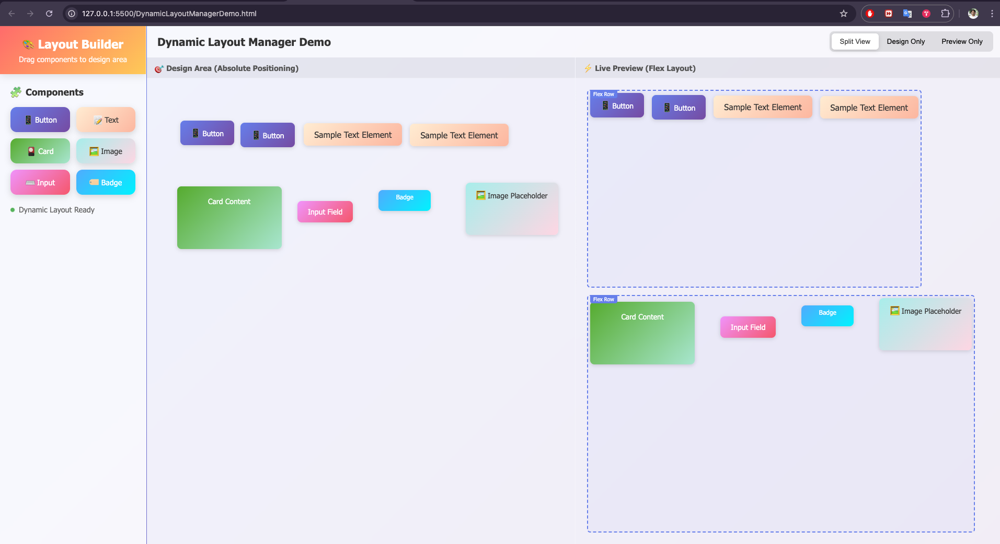

# Dynamic Layout Manager

A JavaScript library for converting absolutely positioned HTML elements into grouped flexbox layouts based on proximity. Perfect for drag-and-drop website or web component builders, it enables auto-layout conversion for a seamless design-to-code workflow.

## Features

- Converts absolute positioning to flexbox layouts
- Groups elements into flex rows based on proximity
- Designed for drag-and-drop web builders
- Real-time preview of flex layout
- Modern, attractive demo UI

## Demo

See `DynamicLayoutManagerDemo.html` for a live demo. The demo features:

- Drag-and-drop palette for Div, Button, Text, and Image components
- Designer area for free placement
- Real-time flex layout preview with borders
- Side-by-side designer and preview sections

### Screenshots





## Usage

1. Include `DynamicLayoutManager.js` in your project.
2. Initialize with your container:
   ```js
   const manager = new DynamicLayoutManager(containerElement);
   manager.initialize();
   manager.convertToDynamicLayout();
   // Use manager.flexRows for flex grouping
   ```
3. See the demo HTML for a full drag-and-drop implementation.

## How It Works

- Scans all absolutely positioned children in a container
- Groups them into flex rows based on vertical proximity
- Converts the layout to flexbox, preserving visual order
- Allows for real-time updates as elements are moved

## Example

```js
const manager = new DynamicLayoutManager(
  document.getElementById("design-area")
);
manager.initialize();
manager.convertToDynamicLayout();
console.log(manager.flexRows); // Array of grouped elements
```

## License

MIT
